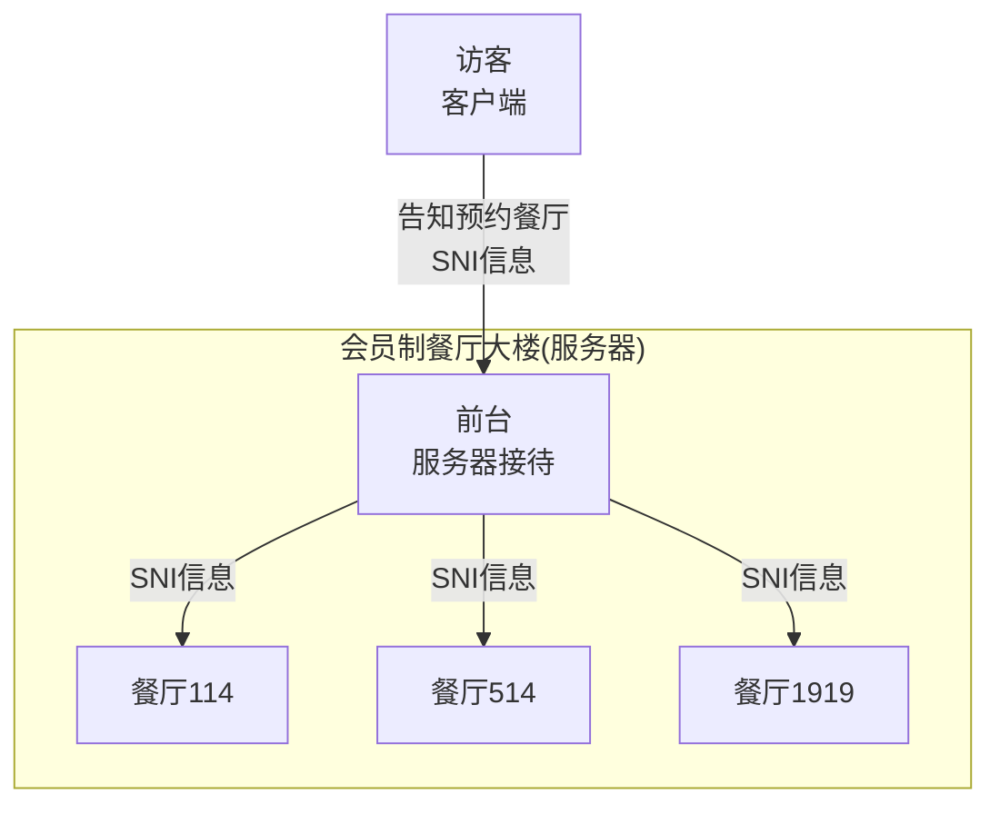
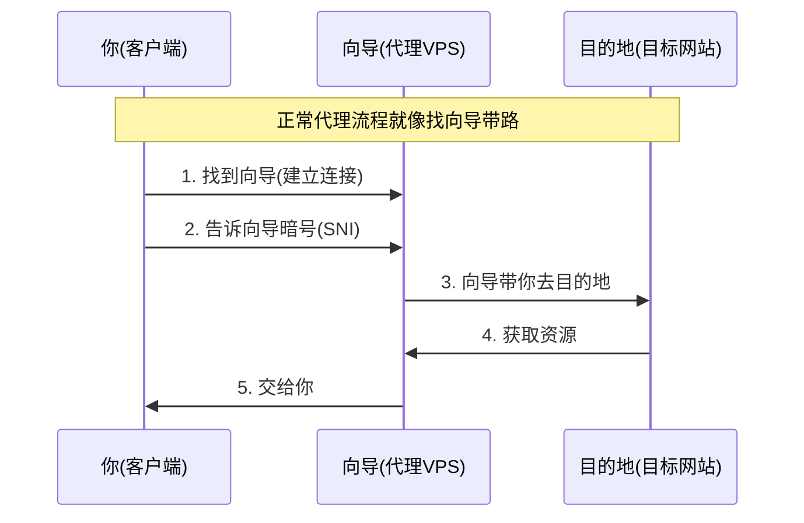
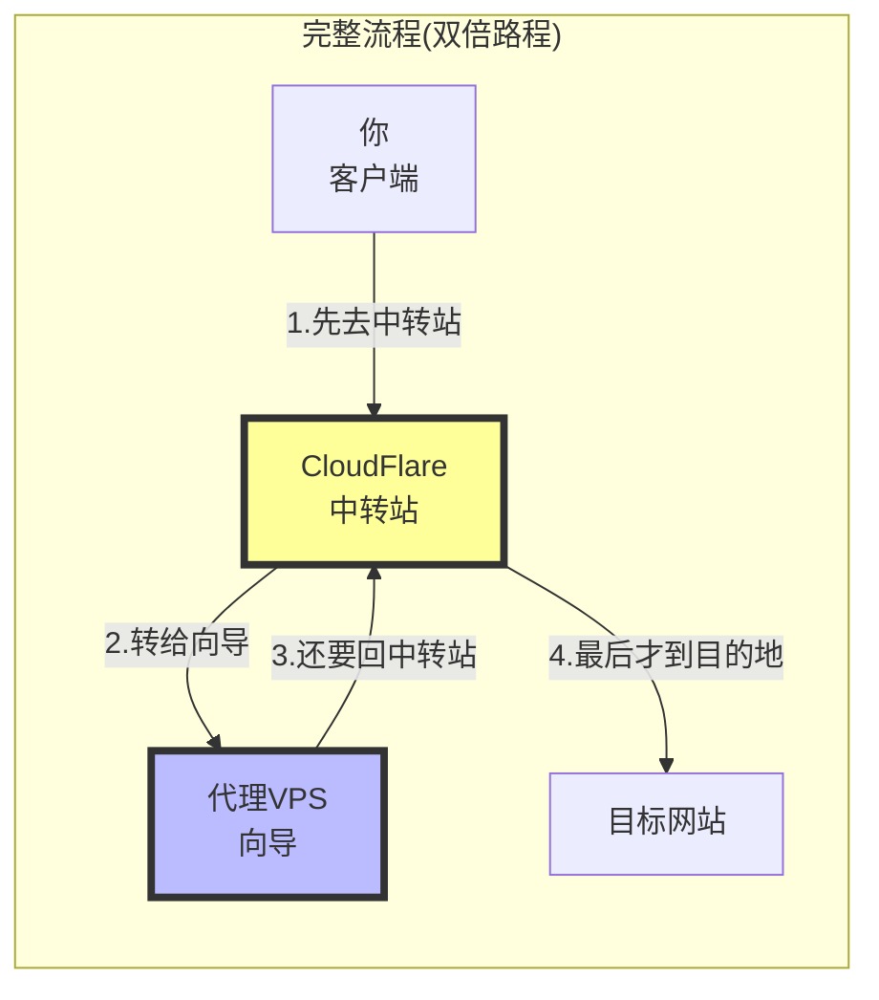
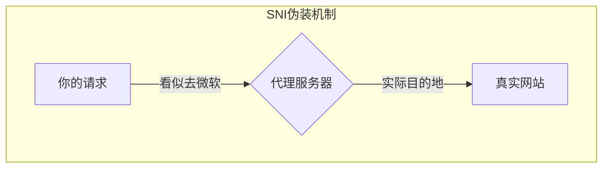
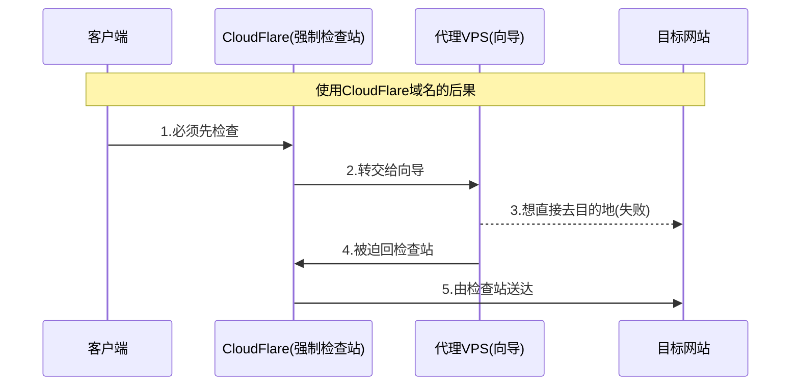
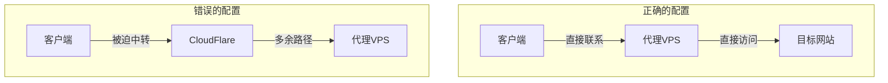

## 1. SNI基础概念

想象一个会员制餐厅大楼：
- 大楼里有多家不同的餐厅（多个网站）
- SNI就像是你的预约信息（"我要去xx餐厅"）
- 前台根据预约信息引导你到对应餐厅

## 2. 正常代理流程

把这个过程想象成：你想去一个需要通过走地道才能到达的地方（目标网站），找了一个老北京人（向导）帮助你。

## 3. CloudFlare劫持流程

现在想象：你原本约好的向导在一个中转站(CloudFlare)工作，所以所有人都必须先去中转站报到。

### 3.1 流量消耗说明

就像本来一次就能到的地方：
- 现在要先去中转站报到
- 再从中转站去见向导
- 向导还要带你回中转站
- 最后才能到目的地

结果：
- 向导要跑双倍的路（代理VPS流量翻倍）
- 路程变长（延迟增加）
- 花费更多（流量费用增加）

## 4. SNI伪装机制

SNI伪装就像是：
- 你有一本特殊的"护照"(SNI)
- 表面写着去普通地方(如microsoft.com)
- 实际是用来通过特殊通道的暗号

## 5. 为什么CloudFlare会劫持流量？

想象CloudFlare像一个强制检查站：
- 如果用了他们的标记(CloudFlare域名)
- 所有相关人员(流量)都必须经过他们检查
- 不能走其他路(直连)

## 6. 最佳实践建议

为避免这种情况，应该：
1. 使用没有CloudFlare代理的域名
2. 或使用IP直连
3. 避免不必要的中转

## 核心要点总结：

1. SNI是访问网站的"预约信息"
2. 代理服务是找"向导"带路
3. CloudFlare域名会迫使流量绕路
4. 流量绕路导致双倍消耗
5. 选择正确的SNI可避免这些问题

